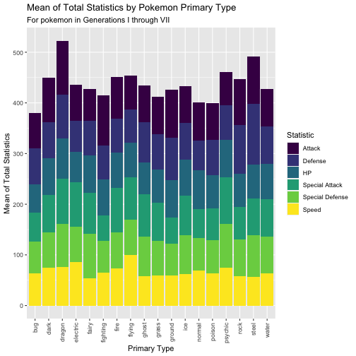

Analysis of Pokemon Stats
========================================================
author: Natalie Weaver
date: February 03, 2021
autosize: true

Introduction
========================================================

Each pokemon has **stats** that determine its abilities in various categories:
* HP (hit points)
* Attack
* Defense

Each pokemon has a **primary type** based on its physiology:
* Water
* Fire
* Rock

Which type of pokemon is the strongest, based on its stats?

Packages and Data
========================================================

```r
# load the packages we need for this analysis
library(pacman)
p_load(tidyverse, magrittr, janitor, viridis)
```

```
# A tibble: 6 x 7
  type1 mean_hp mean_attack mean_sp_attack mean_defense mean_sp_defense
  <chr>   <dbl>       <dbl>          <dbl>        <dbl>           <dbl>
1 bug      56.7        70.1           56.7         70.8            62.5
2 dark     72.6        87.8           74.5         70.5            69.1
3 drag…    79.9       106.            89.6         86.3            84.6
4 elec…    60.5        70.8           87.5         61.8            70.1
5 fairy    73.9        62.1           81.5         68.2            87.8
6 figh…    71.4        99.2           50.1         66.4            63.4
# … with 1 more variable: mean_speed <dbl>
```

Stats Breakdown by Type
========================================================


